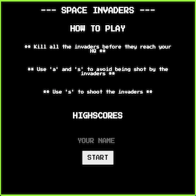
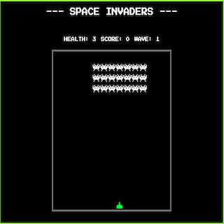
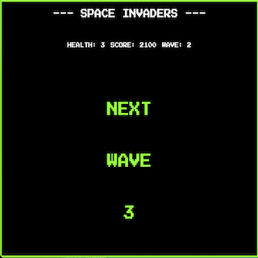
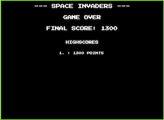

##  General Assembly, Software Engineering Immersive

# Project 1: Space Invaders

## OVERVIEW

SPACE Invaders was my first project of GA's Software Engineering Immersive Course.

Try it out [here!](https://seanfenelon.github.io/project-1/)

This JavaScript game was built solely by me in one week.

## PROJECT BRIEF
* Build a game individually.
* Be creative.
* Render a game in the browser.
* Design logic for winning & visually display which player won.
* Include separate HTML / CSS / JavaScript files.
* Stick with KISS (Keep It Simple Stupid) and DRY (Don't Repeat Yourself) principles.
* Use Javascript for DOM manipulation.
* Deploy your game online, where the rest of the world can access it.
* Use semantic markup for HTML and CSS (adhere to best practices).

### Space Invaders Brief
* Build game based on the classic arcade Space Invaders

### Requirements
The player should be able to clear at least one wave of aliens
The player's score should be displayed at the end of the game
### Suggested enhancements
Responsive design
Each wave gets more difficult
Persistent leaderboard using localStorage

## TECHNOLOGIES USED
* HTML5
* CSS3
* JavaScript ES6
* Git adn Github
* Google Fonts

## APPROACH

I began this project by wireframing the idea, looking at the fundamentals of making the game work - game layout, ship movemnent and shooting, alien movement and bomb dropping shooting, and collision detection.

I determined my MVP and allocated three days to achieve this, with a futher two days for debugging, stylign and strecth goals allowing a final day for last-minute styling and changes.

### The Grid

To create the game grid, I used a for loop to append cells into my grid. The width was set to 15, this is a somewhat arbitrary value chosen for aesthetics.

	for (let i = 0; i < width ** 2; i++) {
	  const div = document.createElement('div')
	  div.classList.add('cell')
	  grid.appendChild(div)
	  cells.push(div)
	}

### Rendering The Game

The initial positions of the ship and aliens were hardcoded; an integer for the ship, and an array of integers for the aliens.

The  ship was rendered on the grid simply by adding the ship class to its position. A forEach was used to add the alien classes to the grid.
	
	cells[ship].classList.add('ship')

	aliensCurrent.forEach((alien) => {
	  cells[alien].classList.add('alien')
	})

## PLAYER MOVEMENT

'A' and 'S' moves the ship left or right by subtracting or adding 1 from the ship position respectively. Both upper and lower cases are accepted here. The ship cannot move through the walls.

	document.addEventListener('keypress', (event) => {
	const key = event.key
	  if ((key === 'k' || key === 'K') && (ship > ((width ** 2) - width))) {
	    cells[ship].classList.remove('ship')
	    ship -= 1
	    cells[ship].classList.add('ship')
	  } else if ((key === 'l' || key === 'L') && (ship < ((width ** 2) - 1))) {
	    cells[ship].classList.remove('ship')
	    ship +=1
	    cells[ship].classList.add('ship')
	  } 
	})

## PLAYER SHOOTING

The 'L' key controls player shooting using an event listener. A setTimeout toggles a shootDelay boolen to allow one shot every 0.5s to add challenge to the game. 

The intial position of the ship is used for shooting and at a set interval the bullet moves up the grid by adding the bullet class to the cell.

Collision detection determines if the bullet collides with an alien bomb, or with an alien.

## ALIEN MOVEMENT

The aliens move right, down a line, and left in an S-pattern. This movement is controlled using a setInterval and direction of movement is determined by comparing the current position with the previous position. The code determines if the alien block has moved left, right or down at the left or right wall usiong IF statements.

	function moveAliens() {
	  
	  let distanceLeft = width
	  let distanceRight = 0
	
	  for (let i = 0; i < aliensCurrent.length; i++) {
	    if (aliensCurrent[i] % width < distanceLeft) {
	    
	      distanceLeft = aliensCurrent[i] % width
	    }
	  }
	  if (aliensCurrent[0] < aliensPrevious[0] || distanceLeft === 0) {
	    moveLeft()
	  } else {
	    moveRight()
	  }
	  function moveLeft() {
	    let distanceLeft = width
	  
	    aliensCurrent.forEach((alien) => {
	      cells[alien].classList.remove('alien')
	    })
	    for (let i = 0; i < aliensCurrent.length; i++) {
	      if (aliensCurrent[i] % width < distanceLeft) {
	        distanceLeft = aliensCurrent[i] % width
	      }
	    }
	  
	    if (distanceLeft > 0) {
	      aliensPrevious = aliensCurrent
	      aliensCurrent = aliensCurrent.map(x => x - 1)
	    } else if (distanceLeft === 0 && aliensCurrent[0] < aliensPrevious[0]) {
	      aliensPrevious = aliensCurrent
	      aliensCurrent = aliensCurrent.map(x => x + width)
	    } else {
	      moveRight()
	    }
	    aliensCurrent.forEach((alien) => {
	      cells[alien].classList.add('alien')
	    })
	  
	  }
	  function moveRight () {
	    let distanceRight = 0
	  
	    aliensCurrent.forEach((alien) => {
	      cells[alien].classList.remove('alien')
	    })
	    for (let i = 0; i < aliensCurrent.length; i++) {
	    
	      if (aliensCurrent[i] % width > distanceRight) {
	        distanceRight = aliensCurrent[i] % width
	      }
	    }
	  
	    if (distanceRight < width - 1) {
	      aliensPrevious = aliensCurrent
	      aliensCurrent = aliensCurrent.map(x => x + 1)
	    } else if (distanceRight === width - 1 && aliensCurrent[0] - 1 === aliensPrevious[0]) {
	      aliensPrevious = aliensCurrent
	      aliensCurrent = aliensCurrent.map(x => x + width)
	    } else moveLeft()
	  
	    aliensCurrent.forEach((alien) => {
	      cells[alien].classList.add('alien')
	    })
	  }
	}
	
A variable to define which direction was moving would be easier

## ALIEN BOMBS

A setInterval is used to call the alienBomb function. This function determines the exposed aliens i.e. the aliens with a clear shot to the ship. A bomb is then dropped from a random selection of these aliens. A setInterval controls the movement of these bombs and collision detection is used in the same manner as the bullet to determine if bomb has hit a bullet or the ship.

## KILLING INVADERS

If a bullet strikes an alien invader, that alien (using its position) is removed from the array of alien positions and disappears.

## NEXT WAVES

The intervals for alien movement, bomb generation and bomb movement, and bullet movement are all functions of an initial value and a multiplier. For the first wave, this is 1 and it is reduced by 0.2 for each wave speeding up all elements of the game.

## GAME SCREENS

There are four game screens:

1. Start Screen - displays rules and highscores, requires name input and has start button.

  

2. Play Screen - grid of aliens, ship, lives, score

  

3. Next Wave Screen - Countdown timer and wave number

  

4. Game Over Screen - Final score and highscores.

  

This was a single-page project, so screens were displayed or hidden using a query selector and display property. 

The countdown timer on the Next Wave Screen is a simple setInterval. The Game Over Screen returns to the start screen once the 10s setTimeout is up.

## HIGHSCORES

Local Storage stores the highscores. Only the top three highscores are stored, therefore the function must retrieve the data from local storage, order it, determine if the next score is a highscore, pop the lowest and push the new score. 

	function addHighscore() {
	
	  const newScore = score
	  const player = { name: newName, score: newScore }
	  const orderedArray = playerScores.sort((playerA, playerB) => playerB.score - playerA.score)
	  if (localStorage.getItem('scores') !== null && playerScores.length === 3) {
	    const oldHighScore = playerScores[2].score
	    if (newScore > oldHighScore) {
	      orderedArray.pop()
	      orderedArray.push(player)
	      playerScores = orderedArray
	    }
	  } else {
	    playerScores.push(player)
	  }
	
	  if (localStorage) {
	    localStorage.setItem('scores', JSON.stringify(playerScores))
	  
	    orderAndDisplayScores()
	  }
	}

## CHALLENGES

This project had several challenges, most notably movement of the alien invaders and collision detection.

1. Alien invader movement: The direction of movement of the aliens was determined by comparing the current and previous position arrays. 

		if (aliensCurrent[0] < aliensPrevious[0] || distanceLeft === 0) {
		    moveLeft()
		  } else {
		    moveRight()
		  }
		  
	By using the alien invader at position 0, if the alien was killed, the current value at index 0 would not always be less than the previous even when moving left across the grid (grid numbers decreasing). This bug was patched. However, using a direction variable would have bypassed the need for the comparisons and bug fixes.
	
2. Collision detection was the other majpr challenge and resulted in bugs to be fixed. Collision detection was handled into the ship bullet and alien bomb functions. If a bullet moved into a cell with an alien or bomb class, collision was detected. However, this needed to be repeated for the alien bomb function should the bomb move into a cell with a bullet. Handling collision detection globally would have resulted in more simple code.

## ARTWORK AND AUDIO

All the icons and audio were taken from classicgaming.cc, an online collection of resourses for classic arcade games.
https://www.classicgaming.cc/classics/space-invaders/sounds

## LESSONS LEARNED

As a first project, I was very happy with the structure and roadmap for the project that I initially created though wireframing and pseudocde. Ultimatley, my logic through pseudocode worked and made sense but in some instances, created patchy code. My main takeaway is to revise the pseudocode and plan for each element of projects as I move to them.
